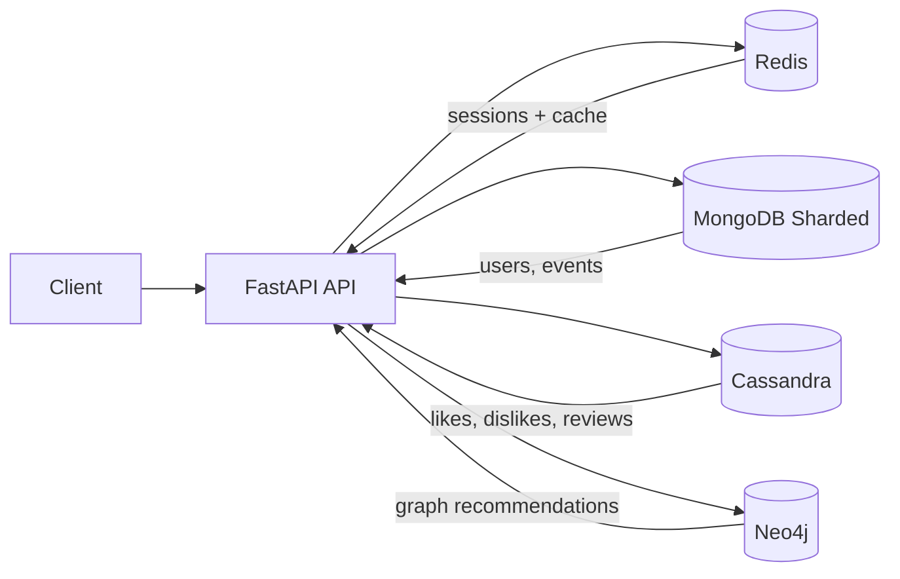

# EventHub

[](https://github.com/Danil-Malafeevskiy/nosql-lab/actions/workflows/eventhub.yml)


Backend-сервис платформы мероприятий для практического изучения NoSQL баз данных. Проект демонстрирует работу сразу с несколькими хранилищами (MongoDB, Cassandra, Redis, Neo4j) в рамках единого API.

## Технологический стек

- Язык: `Python 3.12`
- Веб-фреймворк: `FastAPI`
- ASGI-сервер: `Uvicorn`
- Контейнеризация и оркестрация: `Docker`, `Docker Compose`
- Система сборки/запуска: `Makefile` + `docker compose`
- Базы данных и хранилища:
  - `MongoDB 7` (шардированный кластер) — основные сущности (`users`, `events`)
  - `Cassandra 5` — реакции и отзывы
  - `Redis 7` — сессии и кэш агрегаций
  - `Neo4j 5` — граф лайков и рекомендации

### Основные библиотеки

- `fastapi` — HTTP API и роутинг
- `uvicorn` — запуск приложения
- `pymongo` — доступ к MongoDB
- `cassandra-driver` — доступ к Cassandra
- `redis` — работа с Redis
- `neo4j` — драйвер Neo4j
- `bcrypt` — хэширование паролей

## Архитектура проекта

### Структура модулей

- `lab_1/main.py` — точка входа, запуск Uvicorn
- `lab_1/app/app.py` — сборка FastAPI-приложения, DI через `app.state`, подключение роутеров
- `lab_1/app/routers/` — REST-endpoint'ы (`auth`, `users`, `events`, `session`, `recommendations`, `health`)
- `lab_1/app/storage.py` — создание подключений к MongoDB/Cassandra/Redis/Neo4j
- `lab_1/app/*_service.py` — бизнес-логика (сессии, реакции, отзывы, рекомендации)
- `lab_1/app/settings.py` — валидация env-конфигурации
- `lab_1/app/indexes.py` — индексы MongoDB
- `docker-compose.yml` — локальный стенд всех сервисов
- `cassandra-init/`, `sharding-init/`, `mongo-init/` — bootstrap инфраструктуры БД
- `.github/workflows/eventhub.yml` — запуск автопроверок в GitHub Actions

### Схема взаимодействия компонентов



### Основные сущности и связи

- `User` (MongoDB): `id`, `full_name`, `username`, `password_hash`
- `Event` (MongoDB): `id`, `title`, `description`, `location`, `created_by`, `started_at`, `finished_at`, `category`, `price`
- `Session` (Redis): `sid`, `user_id`, `created_at`, `updated_at`, TTL
- `Reaction` (Cassandra): лайк/дизлайк пользователя к событию
- `Review` (Cassandra): отзыв пользователя по событию (`rating`, `comment`)
- `Recommendation` (Neo4j + Redis cache): рекомендации на основе графа `User -[:LIKED]-> Event`

Связи:
- `User 1..* Event` через поле `Event.created_by`
- `User 1..* Reaction` и `User 1..* Review`
- `User *..* Event` через граф лайков для персональных рекомендаций

## Функциональные требования / Use Cases

- Регистрация и аутентификация пользователя (`/users`, `/auth/login`, `/auth/logout`)
- Управление сессией через cookie `X-Session-Id` (`/session`)
- Создание и просмотр событий (`/events`, `/events/{id}`)
- Фильтрация событий по параметрам (категория, цена, дата, пользователь и т.д.)
- Реакции на события (лайк/дизлайк)
- Отзывы на события (создание, просмотр, частичное обновление)
- Получение персональных рекомендаций (`/recommendations`) на основе похожих пользователей

## API

- Swagger UI (локально): [http://localhost:8080/docs](http://localhost:8080/docs)

### Примеры запросов и ответов

1) Health-check

```bash
curl -i http://localhost:8080/health
```

```json
{
  "status": "ok"
}
```

2) Создание сессии

```bash
curl -i -X POST http://localhost:8080/session
```

Пример ответа (заголовки):

```http
HTTP/1.1 201 Created
Set-Cookie: X-Session-Id=<session_id>; HttpOnly; Path=/; Max-Age=60
```

3) Создание события (требуется cookie сессии)

```bash
curl -i -X POST http://localhost:8080/events \
  -H 'Content-Type: application/json' \
  -H 'Cookie: X-Session-Id=<session_id>' \
  -d '{
    "title":"Python Meetup #42",
    "address":"Nevsky 1",
    "description":"Backend engineers meetup",
    "started_at":"2026-06-15T18:00:00Z",
    "finished_at":"2026-06-15T21:00:00Z"
  }'
```

```json
{
  "id": "665f30186f43a6a6f843cb12"
}
```

## Инструкция по запуску

### Предварительные требования

- `Docker` и `Docker Compose`
- `make`
- свободные порты из `.env.local` (по умолчанию `8080`, `6379`, `7687`, `9042`, `27017`)

### Шаги запуска

1. Клонируйте репозиторий:
   ```bash
   git clone https://github.com/Danil-Malafeevskiy/nosql-lab.git
   cd nosql-lab
   ```
2. Убедитесь, что файл `.env.local` существует и заполнен.
3. Поднимите все сервисы:
   ```bash
   make run
   ```
4. Проверьте состояние контейнеров:
   ```bash
   make services
   ```
5. Проверьте API:
   - `GET http://localhost:8080/health`
   - `http://localhost:8080/docs`

### Остановка и очистка

- Остановка:
  ```bash
  make stop
  ```
- Остановка с удалением volume:
  ```bash
  make clean
  ```

## Конфигурация

Ниже перечислены переменные окружения, используемые сервисом.

| Переменная | Описание | Значение по умолчанию |
|---|---|---|
| `APP_HOST` | Хост приложения | `0.0.0.0` |
| `APP_PORT` | Порт приложения | `8080` |
| `APP_USER_SESSION_TTL` | TTL сессии пользователя (сек) | `60` |
| `APP_LIKE_TTL` | TTL кэша реакций (сек) | `60` |
| `APP_EVENT_REVIEWS_TTL` | TTL кэша отзывов (сек) | `120` |
| `APP_RECOMMENDATIONS_TTL` | TTL кэша рекомендаций (сек) | `60` |
| `REDIS_HOST` | Хост Redis | `redis` |
| `REDIS_PORT` | Порт Redis | `6379` |
| `REDIS_PASSWORD` | Пароль Redis | `` (пусто) |
| `REDIS_DB` | Номер Redis DB | `0` |
| `MONGODB_DATABASE` | Название БД MongoDB | `eventhub` |
| `MONGODB_USER` | Пользователь MongoDB | `eventhub_app` |
| `MONGODB_PASSWORD` | Пароль MongoDB | `eventhub_secret` |
| `MONGODB_HOST` | Хост `mongos` роутера | `mongos` |
| `MONGODB_PORT` | Порт MongoDB | `27017` |
| `MONGODB_AUTH_MECHANISM` | Механизм аутентификации MongoDB | не задано |
| `CASSANDRA_HOSTS` | Список хостов Cassandra через запятую | `cassandra-test` |
| `CASSANDRA_PORT` | Порт Cassandra | `9042` |
| `CASSANDRA_USERNAME` | Пользователь Cassandra | `` (пусто) |
| `CASSANDRA_PASSWORD` | Пароль Cassandra | `` (пусто) |
| `CASSANDRA_KEYSPACE` | Keyspace Cassandra | `testkeyspace` |
| `CASSANDRA_CONSISTENCY` | Consistency level Cassandra | `ONE` |
| `NEO4J_URL` | URL подключения Neo4j | `bolt://neo4j:7687` |
| `NEO4J_USERNAME` | Пользователь Neo4j | `neo4j` |
| `NEO4J_PASSWORD` | Пароль Neo4j | `password` |
| `NEO4J_BOLT_PORT` | Пробрасываемый Bolt-порт Neo4j | `7687` |

## Тестирование

- В репозитории настроены автоматические проверки в GitHub Actions: `.github/workflows/eventhub.yml`.
- Workflow использует reusable-пайплайн из репозитория курса `ndbx`: [sitnikovik/ndbx](https://github.com/sitnikovik/ndbx).
- Проверки запускаются на `push` и `pull_request` в `main/master`.

Рекомендация перед PR:
- локально поднять стенд `make run`
- выполнить smoke-проверку ключевых endpoint'ов через Swagger UI (`/docs`) или `curl`.
